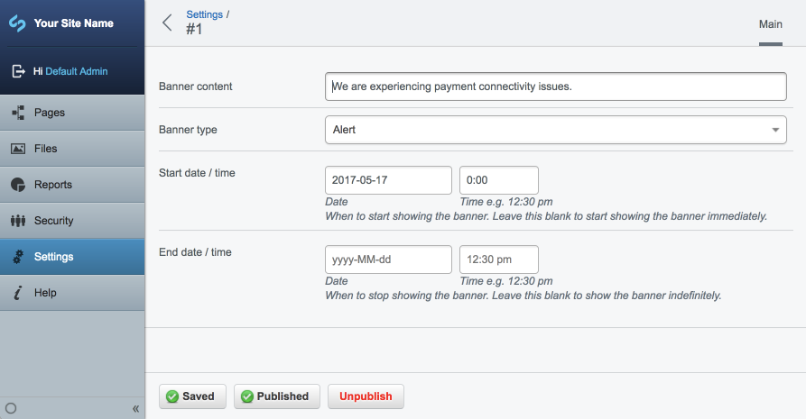

# Site Wide Banners

Allows CMS authors to create site-wide banners,
to alert visitors of important information regardless
of the page they're viewing.

## Features

 * Themeable templates
 * Configure type of alert (defaults to "info", "warning" and "alert")
 * Multiple concurrent alerts
 * Set start/end dates for alert
 * Permission controls
 * Localisation of CMS UI controls and labels
 * Preview and publish through versioning
 * Optional: Rich-text editing (insert links and images)
 * Optional: Sorting through [gridfieldextensions](https://github.com/symbiote/silverstripe-gridfieldextensions)
 * Support for [subsites](https://github.com/silverstripe/silverstripe-subsites)

## Screenshot

(SilverStripe 3.x)

CMS editing screen (with [versioneddataobjects](https://github.com/heyday/silverstripe-versioneddataobjects) enabled)

## Installation

	composer require nzta/silverstripe-sitebanner:

## Configuration

Add the following to your YAML config to activate the module:

	SilverStripe\SiteConfig\SiteConfig:
	  extensions:
	    - NZTA\SiteBanner\ExtensionsSiteConfigExtension

The site banner can be configured in `admin/settings` now.

## Templates

In order to show the banners, you need to add them to your template:

	<% loop $SiteConfig.SiteBanners %>
        

            $Content
        

	<% end_loop %>

## Bootstrap Styles

If you're using Bootstrap, it's easy to get useful default styles for alerts
through a combination of [contextual backgrounds](http://getbootstrap.com/css/#helper-classes-backgrounds)
and [icons](http://getbootstrap.com/components/#glyphicons).

	<% loop $SiteConfig.SiteBanners %>
        <% if $Type == 'info' %>
            

                
                $Content
            

        <% end_if %>
        <% if $Type == 'warning' %>
            

                
                $Content
            

        <% end_if %>
        <% if $Type == 'alert' %>
            

                
                $Content
            

        <% end_if %>
	<% end_loop %>

Examples on the SilverStripe default theme:

## Permissions

By default, every author with access to the "Settings" section (`EDIT_SITECONFIG` permission code)
can set alerts. You can customise this by YAML configuration:

	SiteBanner:
	  required_permission_codes:
	    - ADMIN

## Sorting

You can allow authors to sort multiple alerts by installing
the [gridfieldextensionsn](https://github.com/symbiote/silverstripe-gridfieldextensions) module.
It'll get automatically picked up by the code.

## Limitations

 * Does not trigger republish when [staticpublisher](https://github.com/silverstripe/silverstripe-staticpublisher) is used
